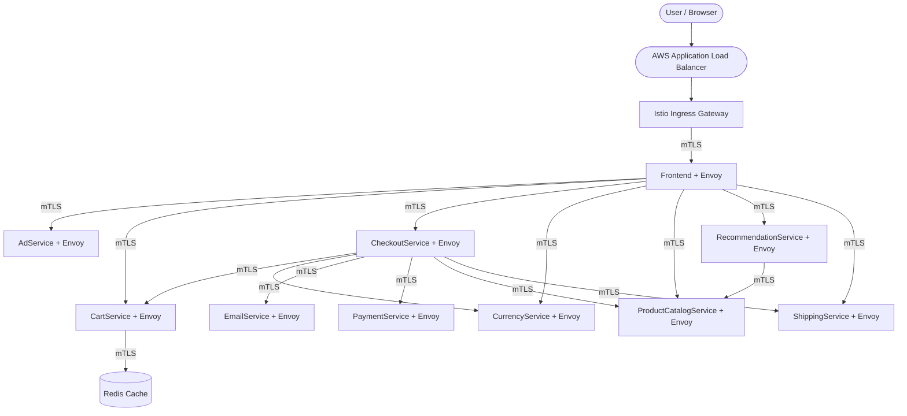

# AWS EKS & Istio Learning Lab 🚀

Welcome to my AWS Kubernetes learning repository! 

This repository documents my journey of learning Amazon Elastic Kubernetes Service (EKS), Terraform, and Istio Service Mesh from beginner to advanced production-grade deployments.

## Current Project: Microservices E-Commerce Application

Currently, this repository holds a production-grade deployment of the **Google Online Boutique** (an 11-tier polyglot microservices application) running on Kubernetes with **Istio**.

### 📊 Architecture & Data Flow

Below is the complete architectural flow showing how traffic moves from the AWS Load Balancer through the Istio Ingress Gateway, and securely communicates between microservices using **mTLS**.

> **Note:** GitHub automatically renders this Mermaid diagram natively!

---

## Detailed Documentation
For a full, step-by-step breakdown of how this was installed, how the data flows, and how Istio was configured via Helm in a production-grade way, please refer to the detailed lab guide:

👉 [**View the Full Lab Documentation (online_boutique_lab.md)**](./online_boutique_lab.md)
