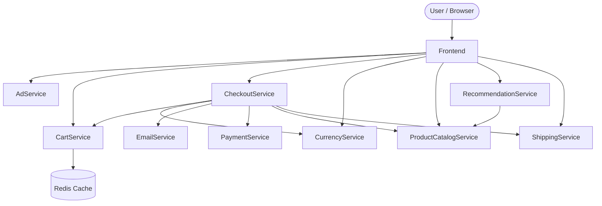
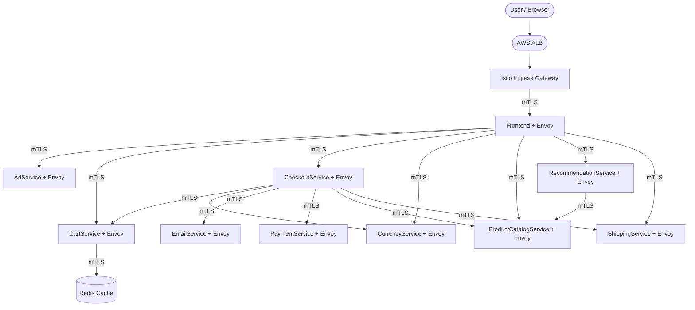

# AWS EKS & Istio Learning Lab 🚀

Welcome to my AWS Kubernetes learning repository! 

This repository documents my journey of learning Amazon Elastic Kubernetes Service (EKS), Terraform, and Istio Service Mesh from beginner to advanced production-grade deployments.

Currently, this repository holds a production-grade deployment of the **Google Online Boutique** (an 11-tier polyglot microservices application) running on Kubernetes with **Istio**.

---

## 1. How It Was Installed

We used **Helm** (a package manager for Kubernetes) to install the application. Here are the exact commands used:

```bash
# 1. Clone the repository containing the Helm chart
git clone https://github.com/GoogleCloudPlatform/microservices-demo.git

# 2. Enter the directory
cd microservices-demo

# 3. Install the application using Helm into the default namespace
helm install online-boutique ./helm-chart -n default
```

> [!NOTE]
> **Why Helm?** Helm acts like a package manager (similar to `apt` or `brew`) but for Kubernetes. Instead of manually applying 30 different YAML files for deployments, services, and configmaps, the `helm-chart` directory templates them all together into one easily installable package!

---

## 2. Microservices Architecture (Data Flow)

Here is a visual representation of how the 11 microservices interact with each other inside your Kubernetes cluster.



---

## 3. How the Data Flows

Let's break down exactly what happens when you visit the page and buy an item:

### 🏠 1. The Entry Point
You open your browser and hit `http://localhost:8080`. Your request hits the `frontend-external` LoadBalancer Service in Kubernetes, which routes your traffic to one of the **Frontend** pods.

### 🛍️ 2. Browsing the Catalog
The Frontend needs to render the HTML page with products. It makes an internal, high-speed network request (using a protocol called gRPC) to the **ProductCatalogService** to fetch the list of items.

### 🎯 3. Recommendations & Ads
To make the page look full, the Frontend also calls the **RecommendationService** (which in turn calls the ProductCatalog) to suggest other items you might like. It also calls the **AdService** to display context-aware advertisements.

### 🛒 4. Adding to Cart
When you click "Add to Cart", the Frontend sends a request to the **CartService**. The CartService is the *only* stateful service in this entire application; it takes your session ID and saves your cart data into the **Redis** database pod so your cart persists even if the Frontend crashes.

### 💳 5. The Checkout Process (The Orchestrator)
When you finally click "Place Order", the Frontend calls the **CheckoutService**. The CheckoutService acts as a conductor for the final transaction. It:
1. Calls **CartService** to get the items currently in your cart.
2. Calls **ProductCatalogService** to verify the items still exist and to get their final prices.
3. Calls **CurrencyService** to convert the total price into your local currency.
4. Calls **ShippingService** to calculate shipping costs and generate a tracking ID.
5. Calls **PaymentService** to process your mock credit card transaction.
6. Calls **EmailService** to send you an order confirmation email.
7. Calls **CartService** one last time to empty your cart.

> [!TIP]
> **Why build it this way?**
> This architecture might seem overly complex for a simple t-shirt store, but it demonstrates true microservice decoupling! 
> - If the `EmailService` crashes, the rest of the store stays online (users can still buy things, they just won't get a receipt immediately). 
> - If Black Friday causes a massive spike in checkouts, we can scale up *just* the `PaymentService` and `CheckoutService` to handle the load without wasting money scaling the `AdService`.

---

## 4. Introducing Istio (Service Mesh)

When we deploy this application natively, it relies on Kubernetes' basic routing. But when we install **Istio**, we radically change how traffic flows into and within the cluster.

### 🚪 Changing the Front Door (ALB vs Istio Gateway)
If you deploy this application to AWS EKS *without* Istio, you would use an **Application Load Balancer (ALB)**. 
- **Without Istio:** The ALB routes traffic directly to the `frontend-external` service, bypassing any advanced routing rules.
- **With Istio:** We delete the `frontend-external` service. Instead, the ALB routes traffic to the **`istio-ingressgateway`** (a dedicated Istio proxy pod). The Gateway checks our custom Istio routing rules (`VirtualServices`) and securely forwards the traffic to the internal `frontend` pods.

> [!IMPORTANT]
> **Why delete the frontend-external service?**
> If we leave the `frontend-external` service alive, internet users can use it to bypass Istio completely! We delete it to force all incoming traffic through the `istio-ingressgateway` so Istio can secure it, monitor it, and route it.

### 💉 Sidecar Proxy Injection (Why we restart pods)
Istio works by injecting a tiny **Envoy Proxy** (a sidecar container) into every single pod alongside your application code. All microservice-to-microservice traffic goes through these proxies.
- **The Problem:** Istio cannot inject a proxy into a pod that is *already running*. The injection must happen at the exact moment the pod is created.
- **The Solution:** Because our 11 microservices were started *before* we installed Istio, we must do a "rolling restart" of all the pods. Kubernetes will terminate the old pods and spin up new ones. As the new ones are created, Istio intercepts the process and automatically injects the Envoy proxy into them.

Once this is done, you will notice every pod has `2/2` containers running instead of `1/1`!

### 📊 Visualizing the Complete Data Flow with Istio

Here is the exact same microservices architecture from Section 2, but updated to show how the data flows *after* Istio is installed. 

Notice how the `frontend-external` service is completely gone. Traffic now enters through the **Istio Ingress Gateway**. Additionally, every single connection between the microservices is now strictly encrypted using **mTLS**, facilitated by the Envoy sidecar proxy inside each pod!



---

## 5. Installing Istio (Production-Grade via Helm)

In a beginner lab, you would normally use `istioctl install --set profile=demo`. However, for a **true production-grade setup**, we use **Helm** to install Istio. 

### Why Helm for Production?
Using `istioctl` installs everything as a giant monolithic package. Helm allows us to manage Istio's components independently. This means we can upgrade the Control Plane without touching the Gateways, version-control our infrastructure, and easily integrate with CI/CD GitOps pipelines (like ArgoCD).

### Step 1: Add the Istio Helm Repository
We first need to tell Helm where to download the official Istio packages. Helm repositories act like app stores for Kubernetes.

```bash
helm repo add istio https://istio-release.storage.googleapis.com/charts
helm repo update
```
* **Logically:** You are adding the official Istio catalog to your local machine and refreshing it to ensure you get the latest production versions.

### Step 2: Install the Istio Base
The "base" chart is the foundation of the Service Mesh. 

```bash
kubectl create namespace istio-system
helm install istio-base istio/base -n istio-system
```
* **What it does:** It creates cluster-wide resources called **Custom Resource Definitions (CRDs)**. Kubernetes natively only understands things like "Pods" and "Services". The base chart teaches Kubernetes new vocabulary like "VirtualServices", "Gateways", and "PeerAuthentications".
* **Why it's needed:** Without the base, Kubernetes would reject any Istio configuration you try to apply because it wouldn't understand the syntax.

### Step 3: Install the Control Plane (Istiod)
The Control Plane is the brain of Istio, running as a pod called `istiod`. 

```bash
helm install istiod istio/istiod -n istio-system --wait
```
* **What it does:** `istiod` handles Service Discovery (knowing where all pods are), Configuration Management (pushing routing rules to the proxies), and Certificate Management (generating secure TLS certificates for every pod).
* **Why it's needed:** The Envoy proxies are "dumb" data planes; they need the `istiod` brain to tell them what to do. The `--wait` flag ensures we don't proceed until the brain is fully online.

### Step 4: Install the Ingress Gateway
In production, the Ingress Gateway (the front door) is installed completely separate from the Control Plane!

```bash
helm install istio-ingressgateway istio/gateway -n istio-system --wait
```
* **What it does:** This spins up a fleet of Envoy proxy pods dedicated *solely* to handling internet traffic coming from your AWS ALB.
* **Why separate it?** If a massive DDoS attack hits your front door, the Ingress Gateway will scale up to handle the load. Because it is separate, the CPU spike won't affect the Control Plane (`istiod`), keeping your internal cluster routing stable.

### Step 5: Enable Auto-Injection & Enforce Security
By default, Istio does not touch your pods to avoid breaking existing applications. We have to explicitly opt-in.

```bash
# Tell Istio to inject Envoy proxies automatically into the default namespace
kubectl label namespace default istio-injection=enabled
```
* **Logically:** We attach a sticky note (label) to the `default` namespace. A webhook inside Kubernetes watches for new pods. If the pod is in a labeled namespace, the webhook pauses the creation, sneaks the Envoy sidecar container into the blueprint, and resumes creation.

```bash
# (Production Security) Force strict mTLS across the entire cluster!
kubectl apply -f - <<EOF
apiVersion: security.istio.io/v1beta1
kind: PeerAuthentication
metadata:
  name: default
  namespace: istio-system
spec:
  mtls:
    mode: STRICT
EOF
```
* **What it does:** This enforces `STRICT` mutual TLS (mTLS). 
* **Why it's needed in Prod:** If a hacker manages to get inside your VPC and tries to sniff the network traffic, all they will see is encrypted gibberish. If they try to send fake traffic directly to the `cartservice`, the proxy will instantly reject it because the hacker doesn't have a valid cryptographic certificate signed by `istiod`.

### Step 6: Restart the Application Pods
Since our 11 microservices were started *before* we labeled the namespace, they missed the injection! 

```bash
kubectl rollout restart deployment -n default
```
* **What it does:** Kubernetes does a rolling restart (terminates old pods and creates new ones gracefully so there is zero downtime). 
* **The Result:** As the new pods spin up, Istio intercepts them and injects the proxy. You will see your pods switch from having `1/1` containers to `2/2` containers!

---

## 6. Configuring the Gateway and VirtualService
Now that Istio is running, we need to tell the `istio-ingressgateway` how to route internet traffic into the cluster. We do this using two special Istio resources: a **Gateway** and a **VirtualService**.

### What is a Gateway?
A Gateway configures the *ports* and *protocols* the cluster will accept. Think of it as a bouncer at a club saying: *"I will accept HTTP traffic on port 80."*

### What is a VirtualService?
A VirtualService is the actual *brain* of Istio routing. It tells the Gateway *where* to send that traffic. Think of it as the host inside the club saying: *"Ah, you are asking for the root path (`/`), please sit at the Frontend table."*

> [!IMPORTANT]
> **VirtualService vs. Kubernetes Service: What's the difference?**
> 
> - **Kubernetes Service:** A basic, simple load balancer. It groups pods together and gives them a single IP address. It is "dumb"—it just sends traffic to pods randomly (round-robin style).
> 
> - **Istio VirtualService:** A highly intelligent routing engine. It *does not replace* the Kubernetes Service; it wraps around it! A VirtualService can do advanced things like: 
>   - *"Send 90% of traffic to Frontend V1's Service, and 10% to Frontend V2's Service."* 
>   - *"If the user is on an iPhone, route them to the Mobile Service."* 
>   - Automatically handle retries, timeouts, and fault injection.
